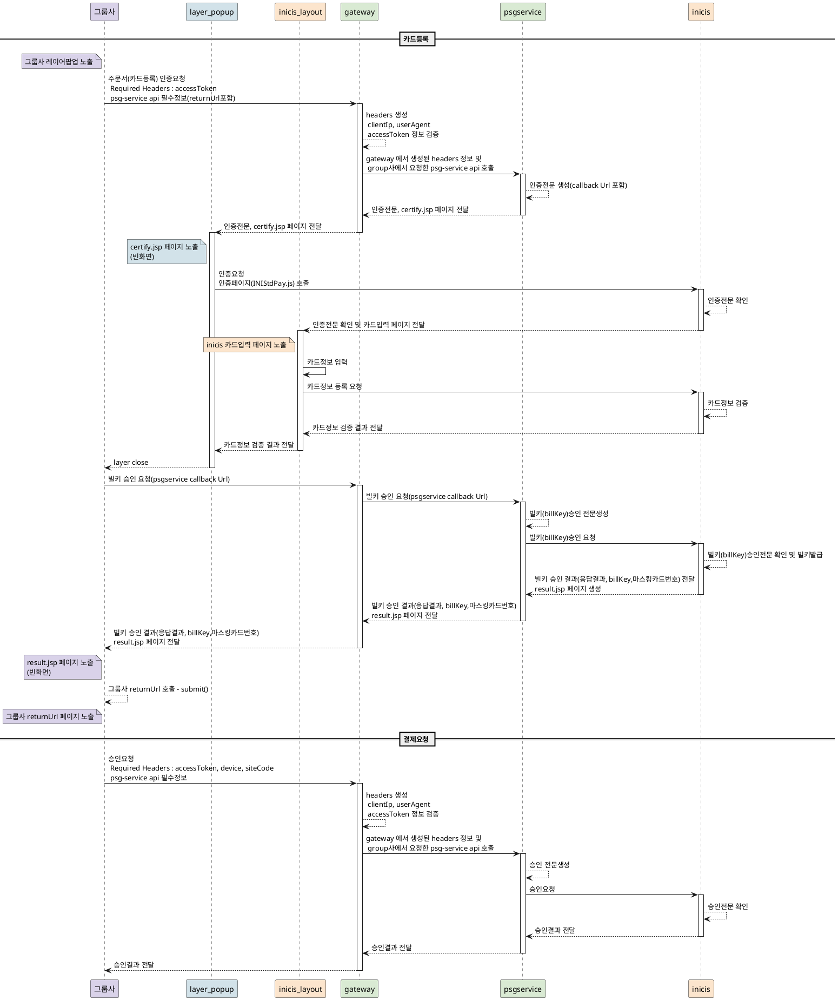

# boilerplate-gateway
gateway 기본 구조 작업


# 참조링크
```yaml

https://ykh6242.tistory.com/entry/Spring-Cloud-Gateway%EA%B0%80-netty-%EA%B8%B0%EB%B0%98-reactive-web-application%EC%9C%BC%EB%A1%9C-%EA%B5%AC%EB%8F%99%EB%90%98%EB%8A%94-%EC%9D%B4%EC%9C%A0

https://developer-youn.tistory.com/180


```
#github 검색 방법

spring cloud gateway pushed:>2023-01-01 stars:>2 language:java

```text
GitHub에서 "Spring Cloud Gateway"와 관련된 리포지토리를 검색하기 위해 사용할 수 있는 몇 가지 검색 쿼리 예시를 아래에 제공합니다. 이 예시들은 GitHub 검색창에 직접 입력할 수 있습니다:

기본 검색:
Copy code
spring cloud gateway
이 쿼리는 "Spring Cloud Gateway"라는 단어가 포함된 모든 리포지토리를 검색합니다.

언어 필터:
sql
Copy code
spring cloud gateway language:java
Java 언어로 작성된 "Spring Cloud Gateway" 관련 리포지토리를 검색합니다.

별점 필터:
Copy code
spring cloud gateway stars:>50
별점이 50개 이상인 "Spring Cloud Gateway" 관련 리포지토리를 검색합니다.

최근 업데이트:
Copy code
spring cloud gateway pushed:>2023-01-01
2023년 1월 1일 이후에 업데이트된 "Spring Cloud Gateway" 관련 리포지토리를 검색합니다.

코드, 설명, README 파일 검색:
Copy code
spring cloud gateway in:name,readme,description
이름, README 또는 설명에 "Spring Cloud Gateway"라는 단어가 포함된 리포지토리를 검색합니다.

정렬 옵션 추가:
bash
Copy code
spring cloud gateway stars:>10 sort:stars-desc
별점이 10개 이상인 "Spring Cloud Gateway" 관련 리포지토리 중에서 별점이 높은 순으로 정렬하여 검색합니다.
```


# docker 및 docker-compose 3개의서버 구성

```shell
docker-compose up --build
```


# plantuml sequance uml
